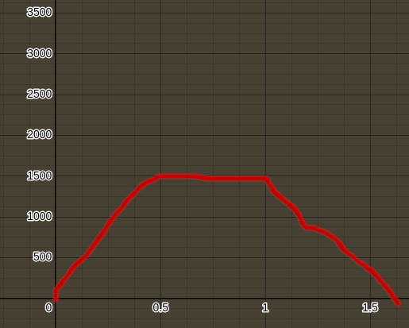
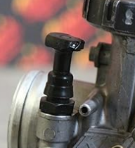
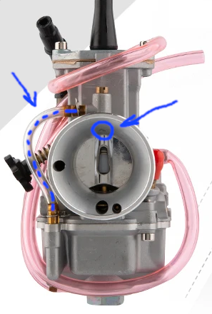

<h2>Оглавление</h2>
<ul>
	<li><a href="#Предисловие">Предисловие</a></li>
	<li><a href="#Терминология">Терминология</a></li>
	<li><a href="#FAQ">FAQ / Мифы о карбюраторах</a></li>
	<li><a href="#Что-влияет-на-работу-карбюратора">Что влияет на работу карбюратора?</a></li>
	<li><a href="#Прежде-чем-начать-настройку">Прежде чем начать настройку...</a></li>
	<li><a href="#Несколько-слов-об-условиях-настройки">Несколько слов об условиях настройки</a></li>
	<li><a href="#Внешний-вид-настраиваемых-систем-карбюраторов-pz30-i-pwk3x">Внешний вид настраиваемых систем карбюраторов PZ30 и PWK3x</a></li>
	<li><a href="#Собственно-настройка-подбор-гтж-или-настройка-высоких-оборотов">Собственно, настройка: подбор ГТЖ (главного топливного жиклёра) или настройка высоких оборотов</a></li>
	<li><a href="#Настройка-холостого-хода-и-подбор-жхх">Настройка холостого хода и подбор ЖХХ (жиклёра холостого хода)</a></li>
	<li><a href="#Холодный-старт-двигателя">Холодный старт двигателя</a></li>
	<li><a href="#Настройка-переходной-системы">Настройка переходной системы</a></li>
	<li><a href="#Настройка-средних-оборотов-или-подбор-положения-иглы">Настройка "средних" оборотов или подбор положения иглы</a></li>
	<li><a href="#Обогатитель-мощностных-режимов-омр">Обогатитель мощностных режимов (ОМР)</a></li>
	<li><a href="#Заключение">Заключение</a></li>
</ul>

<h2 id="Предисловие">Предисловие</h2>

Речь пойдёт именно о настройке карбюраторов типа PZ и PWK или их аналогов. Ожидается, что вы понимаете базовые принципы работы 4-хтактного ДВС и что (и хотя бы в общих чертах - как) делает карбюратор.

Если вы зашли сюда не за полноценной настройкой карбюратора с нуля, а в связи с конкретной проблемой - перейдите в соответствующий раздел и поищите информацию там (или попробуйте поискать по тексту по ключевым словам через ctrl+F).

<h2 id="Терминология">Терминология</h2>
<ul>
    <li><strong>Оборот (для винта)</strong> - подразумевается полный круг вращения, 360 градусов.</li>
    <li><strong>Труба Вентури</strong> - узкое место в просвете карбюратора, как правило расположено в том месте, где находится дроссельная заслонка.</li>
    <li><strong>Стехиометрическая смесь</strong> - идеальная в плане соотношения топлива (паров бензина) и кислорода смесь.</li>
    <li><strong>Богатая смесь</strong> - топливно-воздушная смесь, в которой содержание паров бензина превышает стехиометрическое соотношение.</li>
    <li><strong>Бедная смесь</strong> - соответственно, наоборот.</li>
    <li><strong>Конфузор</strong> - раструб на карбюраторе со стороны воздушного фильтра.</li>
    <li><strong>Диффузор</strong> - со стороны двигателя.</li>
    <li><strong>Главная дозирующая система (ГДЗ)</strong> - главный топливный жиклёр в совокупности с дозирующей иглой (на самом деле, ещё много всего, скрытого в корпусе карбюратора, но для базовой настройки нам достаточно знать этого).</li>
    <li><strong>Нумерация положения иглы</strong> - первое положение - стопорное кольцо установлено на самой верхней проточке, пятое - на самой нижней.</li>
</ul>

<h2 id="FAQ">FAQ / Мифы о карбюраторах</h2>

<ol>
    <li>Каждая система карбюратора влияет только на свой диапазон: ГТЖ на 3/4 и больше открытого газа, игла - от 1/4 до 3/4 и т.д
        

            
Спойлер

            
Пожалуй, самый "известный" миф, возможно, является просто ошибочной формулировкой: на каждом диапазоне работы есть своя <strong>доминирующая</strong> система, т.е. наиболее влияющая. Однако, остальные системы продолжают влиять, так или иначе. К примеру, если взять идеально настроенный холостой ход в классической настройке (т.е. обогащённый, для облегчения запуска двигателя), запустить его, прогреть и понаблюдать за работой двигателя, а затем заглушить двигатель, радикально изменить положение иглы (было бы идеально, если бы в изначальной настройке она была бы, к примеру, в первом положении, а вы для эксперимента перевели её в пятое), и снова его завести, то "невооруженным слухом" вы обнаружите, что режим его работы явно изменился. То же происходит и с ездой на максимальных/околомаксимальных оборотах при изменении положения иглы.

        

    </li>
    <li>Зачем настраивать карбюратор? Я же купил новый мотоцикл, там всё наверняка настроено с завода!
        

            
Спойлер

            
Если коротко, то одним из ключевых факторов, влияющих на работу карбюратора является количество кислорода в фиксированном объёме воздуха. А на это, в свою очередь, влияет множество факторов, такие как высота над уровнем моря (н.у.м.), температура воздуха, влажность воздуха. На производственных линиях все выпускаемые мотоциклы одной модели имеют одни и те же настройки (по понятным причинам), но поступают в разные руки: кто-то живёт в горах, на высоте 800 м н.у.м. и прохладной, влажной погодой, а кто-то - в степях, близких к уровню моря и сухим, жарким климатом. Перейдите к разделу "<strong>Что влияет на работу карбюратора?</strong>", если хотите узнать больше.

        

    </li>
    <li>Цвет нагара на свече при оптимальной настройке должен быть коричневый/серый/<подставьте ваш любимый цвет>
        

            
Спойлер

            
Да, цвет нагара может помочь в диагностике качества смеси, однако не всё так просто. Во-первых, нас интересует её цвет после конкретного режима работы, а не смешанного цикла (что требует специальных "упражнений", чтобы не испортить точность результата). Во-вторых, к примеру, на около-максимальных оборотах температура в камере сгорания настолько велика, что весь нагар со свечи будет сгорать и она будет чистой (разумеется, если у вас не чрезмерно обогащённая смесь, а нормально настроенная). Поэтому увидеть после смешанной езды серую свечу и сказать, что всё ок - будет ошибкой. Да, суммарно из всех режимов работы она - серая. Но это не значит, что у вас просто-напросто чрезмерно богатая смесь на высоких оборотах, и чрезмерно бедная - на низких (на которых вы и ехали последние минуты, до гаража или другого места стоянки).

        

    </li>
    <li>карб pz30 - не настраиваемый / у pwk 30 надо утопить иглу и только так его можно настроить и т.п.
        

            
Спойлер

            
Я, конечно, не отрицаю, что разброс в уровне качества приходящих из Китая бюджетных мотоциклов может быть столь широким, что некоторые карбюраторы приходят абсолютно отвратительные, но если коротко: настройка pz30 возможна, а у карбюраторов pz30 и pwk30(32,34 и т.п) - нет такого "лайфака", как "отключите обогатитель" или "утопите иглу до упора", лишь при применении которого их получается настраивать. Все системы в этих карбюраторах работают и влияют на его режимы. При условии, конечно, что карбюратор не имеет явных дефектов (обнаружить их не составит труда. Речь про проходимость каналов, к примеру, и другие подобные примитивные аспекты). Также ознакомьтесь с разделом "<strong>Прежде чем начать настройку...</strong>", потому что если ваш карбюратор не реагирует на изменение настроек - возможно, дело совсем не в нём.

        

    </li>
    <li>Мот не надо прогревать - сел и поехал!
        

            
Спойлер

            
Это даже вредное утверждение. В первую очередь, для вашего двигателя, особенно если он - воздушного охлаждения. Дело в том, что в двигателе есть предварительно выставленные т.н. тепловые зазоры, которые учитывают расширение деталей в результате нагрева. Соответственно, не выведение двигателя на его рабочую температуру приведёт к избыточным люфтам и износу деталей. Не говоря уже о том, что для нормальной работы двигателя, требуется высокая температура в камере сгорания (для испарения попадающего в неё из системы питания топлива). Перейдите к разделу "<strong>Что влияет на работу карбюратора?</strong>", если хотите узнать больше.

        

    </li>
    <li>Я просто купил новый / другой карбюратор и мот заработал прекрасно!
        

            
Спойлер

            
Что ж, вам везёт! На самом же деле, любой карбюратор так или иначе требует настройки. А вам действительно просто повезло купить карбюратор, более подходящий по своим изначальным настройкам к вашему текущему двигателю (включая индивидуальное состояние вашего двигателя). Более того, 2 разных pz30 могут несколько отличаться в части приготовления смеси, опять-таки из-за индивидуальных особенностей (насколько хорошо, к примеру, полирована внутренняя поверхность карбюратора и т.п.).

        

    </li>
</ol>

<h2 id="Что-влияет-на-работу-карбюратора">Что влияет на работу карбюратора?</h2>

Для начала, немного теории о том, что именно влияет на качество смеси, приготавливаемой вашим карбюратором. Вам этот раздел может быть интересен для понимания, почему вчера мотоцикл звучал одним образом, а сегодня - звучит совершенно иначе, хотя вы не трогали систему питания. В противном случае, можете пропустить этот раздел.

<ul>
    <li><strong>Температура в камере сгорания</strong>
        
Хотя этому аспекту уделяется мало внимания, можно сказать, что он - краеугольный камень работы вашего двигателя. Если представить систему питания (карбюратор, инжектор) как что-то вроде пульверизатора, который просто впрыскивает воздушно-топливную смесь (топливо - те самые пузырьки жидкости, которые изрыгаются соплом пульверизатора), то для того, чтобы эта смесь была воспламенена, требуется не просто искра. Требуются пары горючего в камере сгорания. И здесь начинается самое интересное: если камера сгорания крайне холодная, то топливо банально не будет испаряться! А будет оседать на её стенках, конденсироваться. И пары будут слишком малы в объёме, чтобы привести к реакции возгорания. Именно поэтому, к примеру, на холостом ходу, спустя какое-то время работы, если смесь богаче, чем требуется, вы можете заметить, что обороты вашего двигателя начали плавать и немного снизились, а то и периодически проваливаются. Это говорит о том, что камера сгорания прогрелась до такого состояния, при котором она стала испарять ещё бОльшую часть смеси, чем ранее, что приводит к обогащению смеси (строго говоря, когда мы говорим о качестве смеси - "богатая" \ "бедная" - мы имеем ввиду не ту смесь, которая подаётся в камеру сгорания, а та - её часть, которая испаряется).

    </li>
    <li><strong>Количество кислорода в воздушной смеси (высота над уровнем моря, температура воздуха, влажность)</strong>
        
(В скобках перечислены факторы, влияющие на кол-во кислорода) Да, в воздушной смеси. Вспомним, что воздух - смесь газов, и кислород - лишь их часть. Имейте ввиду, что его процент в этой смеси варируется, в зависимости от перечисленных выше факторов. Вам ведь тяжелее дышать в горах, а? Как и вашему карбюраторному другу, вы наверняка замечали. Всё потому, что там воздух имеет мЕньший процент кислорода. Аналогично влияют и температура воздуха, и влажность.

        
<blockquote>
Парадоксально, но как при очень высокой, так и при очень низкой температуре воздуха, требуется больше бензина в топливно-воздушной смеси. Хотя это и не аксиома, но имейте ввиду, что чем холоднее воздух, тем он "плотнее": на тот же куб воздуха будет больше кислорода. Почему же при высокой температуре требуется больше бензина? Вероятно, это связано с тем, что температура поверхностей в двигателе (да что там, в двигателе.. даже в самом карбюраторе!) настолько высока, что топливных паров банально не хватает: топливо испаряется слишком быстро! Об этом в том числе говорится в мануалах по старым-добрым мотоциклам как зарубежного, так и отечественного производства. Да и сам я столкнулся с этим на практике: в +40С при длительной езде по трассе, на высоких оборотах, получил настолько бедную смесь, что мотоцикл начал глохнуть. И лишь после некоторого времени простоя - он мог продолжить нормально работать, пока, в конце-концов, я не поменял ГТЖ на бОльший.
</blockquote>
        

    
</ul>

<h2 id="Прежде-чем-начать-настройку">Прежде чем начать настройку...</h2>

Чтобы ваши старания не прошли зря, пройдитесь по следующему чек-листу:

<ol>
    <li>Свеча дает стабильную искру.</li>
    <li>Вы отрегулировали / проверили зазоры клапанов.</li>
    <li>У вас корректно выставлен момент зажигания (ну либо вы, хотя бы, не трогали его с завода!).</li>
    <li>Газораспределительный механизм (ГРМ) исправен.</li>
    <li>Свечи подобраны с правильным калильным числом и установлен нужный зазор электродов.</li>
    <li>Воздушный фильтр чист.</li>
    <li>Карбюратор чист.</li>
    <li>Подсос воздуха отсутствует (в воздушном фильтре / коробе / патрубках / корпусе карбюратора).</li>
</ol>

Как именно всё перечисленное делать - выходит за рамки данной статьи. В целом, если в процессе настройки карбюратора вы не будете замечать отсутствие реакции на ваши регулировки - можно (хотя это и не совсем правильно) принебречь этими проверками. Но помните, что изменения в перечисленных системах ощутимо влияет на работу вашего карбюратора.

<blockquote>
Для примера, просто попробуйте, не меняя настроек карбюратора, заменить старый убитый воздушный фильтр на абсолютно новый и посмотрите нагар на свече после тех же режимов работы, что и ранее!
</blockquote>

<h2 id="Несколько-слов-об-условиях-настройки">Несколько слов об условиях настройки</h2>

Помните:

<ul>
    <li>сравнение результатов, вследствие изменения настроек необходимо проводить в одних и тех же условиях. То есть, если вы решили поработать над диапазоном средних оборотов, желательно делать это в течение одного дня (разумеется, в рамках дня со стабильной погодой!). Я бы предложил вам выбрать один и тот же участок дороги с хорошим асфальтом, отлично просматриваемый, прямой и позволяющий вам разогнаться до максимальной скорости и продолжать следовать на ней какое-то время, а затем, в процессе экспериментов - разворачиваться и повторять процедуру (для исключения потенциального влияния направления ветра / уклона местности, замер каждой настройки лучше проводить в обоих направлениях. Т.е., взяли ГТЖ 102, проехали вперёд и назад - обратили внимание на максимальную скорость в обоих случаях. Поменяли на 105-ый ГТЖ, и снова проехали в обоих направлениях. А сравнение же делаем - соответствующих отрезков).</li>
    <li>результат настройки необходимо отслеживать только на прогретом до рабочих температур двигателе (исключение - настройка "холодного старта").</li>
    <li>Настройку необходимо производить на чистой от нагара свече, и максимально не давая двигателю работать в других режимах кроме того, который вы настраиваете.</li>
</ul>

Также исключите влияние топлива: заправьте полный бак или хотя бы заправляйтесь на одной и той же заправке в течение экспериментов.

<h2 id="Внешний-вид-настраиваемых-систем-карбюраторов-pz30-i-pwk3x">Внешний вид настраиваемых систем карбюраторов PZ30 и PWK3x</h2>

Доп.пояснения:

<ul>
    <li>Винт оборотов ХХ, по сути, просто упирается в заслонку. И его вкручивание приводит к тому, что вы поднимаете её всё выше, тем самым подавая больше воздуха (увеличивая обороты двигателя) и всё больше задействуя главную дозирующую систему.</li>
    <li>Винт качества смеси ХХ на разных карбюраторах работает по-разному: Для тех, где он расположен ближе к камере сгорания он чаще является дозирующим количество топливно-воздушной смеси, подаваемой на ХХ (откручивание - увеличивает), а для тех, где он расположен ближе к воздушному фильтру - количество воздуха в смеси ХХ (откручивая - увеличиваем кол-во воздуха, т.е. обедняем смесь).</li>
    <li>на карбюраторах типа PWK вы можете получить доступ к жиклёрам просто открутив болт внизу поддона. Упростить доступ к нему можно, ослабив хомуты крепления патрубков карбюратора и развернув его, как вам нужно. После снятия ГТЖ вы сможете поменять и жиклёр ХХ. Имейте ввиду, что чаще всего такой поддон не имеет слива, и потому открутив болт поддона вы рискуете облить всё вокруг бензином. Чтобы избежать этого, вы можете откачать его шприцом или грушей, через шланг обогатителя мощностных режимов. Он расположен в поддоне не у самого дна, так что часть топлива всё же останется в поддоне. На карбюраторе PZ30 вам для замены жиклёров придётся снимать поддон. Зато, у его поддона есть сливной шланг, позволяющий предварительно осушить поддон.</li>
    <li>Обогатитель мощностных режимов - дополнительная форсунка, как правило, опущенная в просвет диффузора карбюратора на определенный уровень. Создаёт дополнительный приток топлива, обогащая смесь, на том уровне открытия заслонки, на котором собственно находится форсунка в просвете.</li>
</ul>

<h2 id="Собственно-настройка-подбор-гтж-или-настройка-высоких-оборотов">Собственно, настройка: подбор ГТЖ (главного топливного жиклёра) или настройка высоких оборотов</h2>

Вы не ошиблись: мы начнём с подбора ГТЖ. Правда, для этого потребуется возможность завести мотоцикл. Если настройка вашего карбюратора совсем не позволяет этого сделать, перейдите к разделу "<strong>Настройка холостого хода и подбор ЖХХ (жиклёра холостого хода)</strong>" и как только сможете заставить его хоть как-то работать на холостых - возвращайтесь.

<blockquote>
На самом деле, настройка карбюратора происходит циклично: все системы связаны друг с другом, так что после изменения одной системы (к примеру, ГТЖ), вы можете заметить влияние изменения на систему ХХ (холостого хода), и наоборот... а можете и не заметить. Если заметите - не волнуйтесь, просто вернитесь к соответствующему разделу и доведите систему до нужного вам состояния.
</blockquote>

Нам потребуется хорошо просматриваемый, безопасный открытый участок дороги с хорошим асфальтом, чтобы открыть ручку газа до упора, отщёлкать все передачи и на последней - проехаться в режиме "газ в пол" хотя бы 20-30 секунд (надеюсь, вы уже закончили обкатку двигателя перед этим?). Затем, буквально не меняя положения ручки газа, заглушите двигатель и после этого выжмете сцепление.

<blockquote>
Не спешите переводить "kill-switch" (кнопку аварийной остановки двигателя) в положение "ВКЛ" <strong>сразу же</strong>, т.к. поршень всё ещё продолжает по инерции двигаться и может "подхватить" вновь включенное зажигание и снова запустить двигатель.
</blockquote>

Остановитесь на обочине и дайте мотору немного остыть (15 минут точно должно хватить, но возможно хватит и 7-ми) - так вы сможете безопасно выкрутить свечу зажигания. Извлеките её и осмотрите три места:

<ol>
    <li>Белый фарфор изолятора</li>
    <li>круг резьбы, который обращен к вам, когда вы заглядываете вглубь "колодца" (в котором установлен "фарфор"). Черный здесь, на фото: </li>
    <li>Собственно внешний электрод (на фото - загнут буквой "Г") и его "корень" (место, где он приварен к резьбовой части свечи).</li>
</ol>

Начнём с самого явного: фарфор имеет чёрный нагар (либо на всей поверхности, либо на её части):  

Наличие нагара любой "степени тяжести" на фарфоре свечи именно после такого режима работы двигателя свидетельствует о чрезмерно богатой смеси. Для верности, можете прокатиться в режиме высоких оборотов подольше, ~15 минут, однако, лучше пусть это будут 78-83% от максимально развиваемых вашим двигателем оборотов.

<blockquote>
Допустим, на нейтральной передаче, или пониженной (3 или 4-ой) - ваш двигатель может развивать 9000 об.\мин. Тогда, на последней (к примеру, 5-ой) передаче вам следует держать его обороты в диапазоне 7000-7500 об.\мин (чем ниже - тем безопаснее для вашего двигателя). В любом случае, опирайтесь в первую очередь на красную зону оборотов вашего двигателя. Всё, что ниже - достаточно безопасно держать долго, на хорошо обкатанном мотоцикле.
</blockquote>

При таком режиме, нагар со свечей должен очищаться ввиду высоких температур и частых "прожарок" сгоранием топливной смеси. Исключением является нагар на фарфоре в глубине "колодца": т.к. эта часть "холоднее", нагар там всё же ещё может налипать (В таком случае, ваша смесь будет близка к оптимальной!).

Однако, даже если вы не видите нагара на "пиковой" части фарфора, вы всё ещё можете иметь чрезмерно богатую смесь, т.к возможно длительности езды просто не хватило для появления нагара, но есть и другие симптомы...

Вы слышите "стрельбу" в глушитель (да, это буквально звучит, как стрельба)? Мотоцикл не может выйти на максимальные обороты (если они вам заранее известны)? Ваш мотоцикл дёргается, "спотыкается"? Поздравляю, у вас неподходящий ГТЖ.

"Стрельба" в глушитель говорит о догорании бензина в выхлопной трубе, а значит, его поступает слишком много. "Спотыкающийся" мотоцикл (ещё это можно описать так, словно ваш мотоцикл дёргают за хвост, не давая ему держать ровное ускорение) или невозможность развить максимальные обороты может говорить как о богатой, так и о бедной смеси.

Итак, если у вас "стрельба" в глушитель или нагар на фарфоре - смесь богатая.

Если же мотоцикл дёргается, то: если есть нагар на свече - у вас слишком богатая смесь. иначе - бедная.

Также, существует такое наблюдение: если в режиме "газ в пол" вы совсем нееееемнооооого прикрываете газ, и видите, что обороты/скорость начали расти (хотя уклон дороги/ветер и прочие условия - не менялись) - у вас немного обогащённая смесь (при закрытии дросселя вы чуть больше "затыкаете" ГТЖ. Да, просвет для воздуха в трубе Вентури тоже уменьшается, но влияние на объём подаваемого топлива значительно больше).

Измените ГТЖ на один шаг и повторите проверку. Повторите это до того момента, когда симптомы проблемы со смесью перестанут появляться. Обратитесь к разделу "<strong>Внешний вид настраиваемых систем карбюраторов PZ30 и PWK3x</strong>", чтобы понять, как заменять ГТЖ.

<blockquote>
Можно сделать ещё один шаг, чтобы дополнительно обогатить\обеднить смесь, для определённых целей (к примеру, экономии топлива). Но делайте это только в случае, если размеры ваших ГТЖ с небольшим шагом, например - 2 или 2.5 . Не стоит так делать если шаг, к примеру, 5 единиц, т.к это приведёт к чрезмерному "перекосу" и может быть вредно для двигателя.
</blockquote>

<h3>ВАЖНО!</h3>

Если вы не нашли ни одного из симптомов, и мотоцикл прекрасно себя чувствует, я бы рекомендовал вам всё же определить чрезмерно богатый ГТЖ путём перебора (постепенно увеличивайте ГТЖ, пока мотоцикл не начнёт "спотыкаться" в указанном режиме работы), а затем сделать "шаг назад" (установить ГТЖ на один размер меньше, чем тот, который богатит и заставляет "спотыкаться"). Так вы сможете быть уверены, что не имеете слишком бедную смесь на подобных режимах работы и не рискуете получить перегрев двигателя со всеми вытекающими последствиями.

Свеча, работающая на бедной смеси, выглядит примерно так (вы можете видеть отсутствие нагара или даже какого-то затемнения не только на фарфоре, но и практически полное его отсутствие на внешнем кольце резьбовой части, а также на внешнем электроде и даже его "корне" (как правило, там есть хоть какой-то налёт)):

<h2 id="Настройка-холостого-хода-и-подбор-жхх">Настройка холостого хода и подбор ЖХХ (жиклёра холостого хода)</h2>

Основная задача в подборе ЖХХ и настройке ХХ - хороший холодный старт двигателя и комфортный его переход из режима холостого хода (и низких оборотов) в режим работы главной дозирующей системы.

Изучите схемы в разделе "<strong>Внешний вид настраиваемых систем карбюраторов PZ30 и PWK3x</strong>", чтобы понять, где и какие системы расположены.

<h2 id="Холодный-старт-двигателя">Холодный старт двигателя</h2>

Надеюсь, что с завода ваш двигатель хоть как-то заводится. Если да, то можете пропустить следующий абзац.

Если же двигатель не заводится в принципе, то, для начала, не забудьте убедиться, что топливо поступает в карбюратор. Также попробуйте слегка приоткрывать заслонку при запуске и держать в таком положении. Поэкспериментируйте с её положениями. Ещё можно попробовать впрыснуть небольшое кол-во топлива в камеру сгорания через свечное отверстие и предпринять запуск уже после этого. Если же ничего из этого не помогает, попробуем "сброс до заводских настроек": на PZ30 закрутите винт качества до упора (без усилий!), а затем открутите на 2.5 оборота (по сути, от "до упора", до "2.5 оборотов" - это основной диапазон регулировки качества ХХ на PZ30. Если при бОльшем выкручивании что-то и меняется, то необходимость выйти из основного диапазона скорее говорит о неоптимально подобранном жиклёре ХХ). Для PWK3x: закрутите винт качества до упора и открутите на 1 оборот. Далее пробуйте "играть" положением заслонки через винт оборотов ХХ или как описано выше, управляя её положением через ручку газа, пытаясь найти положение, в котором двигатель "схватывает". Никакое положение не помогает? Закрутите винт качества на полоборота (на PWK3x - открутите) и попробуйте снова. И так далее. Если совсем ничего не помогает, обратитесь к разделу "<strong>Прежде чем начать настройку...</strong>", возможно проблема вовсе не в карбюраторе.

Прогрейте двигатель (5-ти минут работы на холостом ходу должно быть достаточно для наших дальнейших экспериментов).

Отрегулируйте винт оборотов ХХ так, чтобы обороты на тахометре были в диапазоне 1500-2000 об/мин.

Затем наша задача - найти "полку" оптимальной смеси. Что это? Если представить положение винта качества (далее, сокращённо - в.к.) смеси и зависимость оборотов двигателя от него - как график, где по оси Х у нас - положение в.к. (чем правее, тем больше закручен, к примеру), а по оси Y - обороты двигателя, то график будет похож на следующий:

Как видите, в этом примере в промежутке с закрученного на полоборота в.к., до закрученного на 1 полный оборот - мы видим ту самую "полку": обороты двигателя почти не менялись.

<strong>Как же её найти?</strong> Отметьте для себя, на сколько сейчас оборотов ваш в.к. откручен. На заведённом двигателе начните вращать в.к., сначала в одну сторону, пока не дойдёте до момента, когда двигатель начнёт снижать обороты (либо даже сразу - глохнуть). Возможно, он сразу начнет реагировать снижением, тогда ваши настройки изначально были не на "полке" (а где-то от 0 до 0.5, или же от 1 до 1.5, если смотреть на примере графика выше). Затем, начните вращать в.к. в другую сторону, в поисках того кол-ва оборотов винта, при котором двигатель перестанет реагировать изменением оборотов на тахометре. Как только он перестал реагировать на ваши обороты в.к. - вы добрались до "полки". Отметьте кол-во оборотов в.к., на которых это начало происходить. Так мы узнали один "край полки". Продолжайте вращать в том же направлении. Обратите внимание, что обороты на тахометре не меняются. Продолжайте вращать, пока не найдёте "другой конец" полки, когда обороты начнут падать. Также отметьте обороты в.к., на которых этот другой "конец полки" находится.

<strong>Я не могу найти оба края полки! Двигатель просто глохнет.</strong> Видимо, ваш ЖХХ неоптимален. Установите богаче/беднее, в зависимости от того, когда двигатель глохнет (если при обогащении - установите беднее, и наоборот).

<strong>И что с этим делать?</strong> Зависит от ваших задач. Если двигатель работает в довольно разных режимах (холод/жара, равнины/горы), то, очевидно, имеет смысл выставить качество смеси посередине "полки". Если же двигатель работает всегда +- в одних условиях, вы можете обогатить смесь, выставив по более богатому краю смеси - для более лёгкого запуска, либо - по более бедному краю смеси, для экономии топлива на околохолостых оборотах.

<strong>А сколько выставить обороты ХХ?</strong> Обратитесь к мануалу вашего мотоцикла, чтобы определить, в каком диапазоне их необходимо выставить. После настройки смеси вы легко сможете это сделать с помощью винта оборотов ХХ. Для более лёгкого запуска в холодную погоду их можно выставить побольше. Как пример, для двигателя 169FMM с big bore (249cc) при хорошо настроенной смеси, двигатель может работать хоть при 800 об/мин, но обычно выставляется ~1300-1500 об/мин: на таких оборотах двигатель воздушного охлаждения достаточно эффективно остывает. Я же предпочитаю 1800-2000, т.к. часто бываю в горах. Да и "дёргается" мот при такой настройке (в момент перехода с оборотов около ХХ на работу ГДЗ) меньше.

<strong>После прогрева на ХХ, двигатель начинает как-то нестабильно работать, как-будто захлёбываясь</strong> Одной из вероятных причин может быть чрезмерно богатая смесь (камера сгорания прогревается сильнее, отчего бОльший процент бензина в смеси начинает испаряться и она становится богаче).

<strong>После прогрева на ХХ, после езды на средних оборотах, при закрытии газа двигатель не сбрасывает обороты до холостых, или сбрасывает, но очень медленно</strong> Возможно, у вас слишком бедная смесь на ХХ, обогатите её винтом качества.

<strong>Зачем нужен подсос / choke на карбюраторе?</strong> Для лучшего холодного старта двигателя, или упрощённого его запуска в холодную погоду. На PZ30 вы можете поэкспериментировать с положением рычага подсоса (расположен слева по ходу мотоцикла, на самом карбюраторе. Также возможен вариант с подсосом на руле, но я здесь буду описывать именно рычажный вариант на карбюраторе). Рычаг имеет три положения: рабочее (просвет конфузора полностью открыт. Боковой рычаг подсоса на карбюраторе - опущен вниз до упора), среднее (просвет частично закрыт. Боковой рычаг в среднем положении), и "холодное" (просвет полностью закрыт, воздух подаётся по специальным каналам ХХ ниже заслонки. Боковой рычаг - в самом верхнем положении). На PWK3x в качестве подсоса выступает специальная "заглушка:

Вытягивая её вертикально вверх, до щелчка, вы открываете обходной канал, который задействует уже другую топливную систему, кроме системы ХХ.

<blockquote>
    
При моих настройках карбюратора PWK 30 мне до +5 С так и не пришлось использовать подсос: двигатель запускался и без того отлично (а с подсосом наоборот - глох). Возможно, при более низких температурах эта система может быть эффективна... но я не советую ездить на мотоцикле при околоотрицательных температурах воздуха.

</blockquote>

<h2 id="Настройка-переходной-системы">Настройка переходной системы</h2>

... осуществляется, чаще всего, посредством ЖХХ. Переходная система - это такая система, которая работает после системы ХХ, при небольшом открытии дроссельной заслонки, но ещё до полномощного включения ГДЗ в работу.

К примеру, у PZ30 она представляет собой маленькое отверстие, которое вы можете видеть ПОД гранью дроссельной заслонки (т.е., когда заслонка полностью закрыта - это отверстие не участвует в питании двигателя). Но питается эта система от ЖХХ, соответственно лишь его калибр определяет качество её работы.

Как правило, если у вас возникает неприятное дёрганье/провал/рывок при приоткрытии ручки газа во время движения на холостых (и у вас не слишком большой провис приводной цепи, не слишком небольшие обороты ХХ) - это проблема, связанная с переходом где-то между "система ХХ - переходная система - средние обороты (положение иглы)". О последней мы поговорим ниже.
Кстати, существует модификация pz30 - bpz30, которая имеет дополнительную мембрану, включающуюся в работу во время этого самого перехода, тем самым смягчая озвученную проблему.

<h2 id="Настройка-средних-оборотов-или-подбор-положения-иглы">Настройка "средних" оборотов или подбор положения иглы</h2>

Как я упомянул чуть выше, настройка этой системы влияет на то, как плавно происходит переход от системы ХХ к питанию от ГТЖ, т.к. ведущее влияние на качество смеси на средних оборотах (в диапазоне от "начал открывать ручку газа" и до ~75% открытия) оказывает игла, дозирующая подачу топлива из ГТЖ. Но не стоит забывать, что положение иглы также оказывает небольшое влияние на езду на открытой на 75% (и больше) заслонке, равно как и на холостой ход.

<strong>Как же настраивать положение иглы?</strong>

Для начала, можно установить иглу в среднее положение (установив стопорное кольцо на игле на прорезь номер 3, центральную). Велика вероятность, что если остальные ваши системы настроены хорошо, этого будет достаточно. Иначе - надо наблюдать симтомы, с которыми вы сталкиваетесь при езде в указанном диапазоне. По сути, всё то же, что делалось для ГТЖ, справедливо и здесь, с той лишь разницей, что нагар надо проверять после езды в среднем диапазоне дросселя.

Если вы упрётесь в границы настройки (стопорное кольцо на 1-ой из 5-ти меток (если считать сверху), а у вас всё ещё слишком богатая смесь в средних режимах, например. Или наоборот, уже на 5-ой метке - и слишком бедная), то вам потребуется заменить ГТЖ на один шаг в нужную сторону и повторить настройку "средних" оборотов (возможно также придётся донастроить ХХ).

<blockquote>
    
Обратите внимание, что вы, в таком случае, измените ГТЖ, который по идее у вас уже должен быть идеально настроенным, если вы шли по порядку данной статьи. А значит, вы сделаете его режимы не оптимальными. В таком случае, приходится выбирать, чем пожертвовать. Однако у некоторых версий PWK есть преимущество: обогатитель мощностных режимов (о нём мы поговорим далее).

</blockquote>

Если же настройка вас абсолютно устраивает, вы можете сделать разгон - резвее, обогатив смесь (сдвинув стопорное кольцо на одно деление вниз), или расход топлива - экономнее (обеднив смесь). Решать вам.

<h2 id="Обогатитель-мощностных-режимов-омр">Обогатитель мощностных режимов (ОМР)</h2>

У ряда карбюраторов PWK имеется специальное дополнительное отверстие, к которому подходит отдельный топливный шланг, питающий эту систему из поплавковой камеры:

Работает эта система так: на максимально открытой заслонке, в верхней части конфузора разряжение достигает такой силы, что по дополнительному шлангу также начинает поступать топливо.

Это позволяет сделать ГТЖ более бедным (для экономии топлива или для более гладкой настройки положения иглы) и при этом в режиме "полный газ" иметь достаточно богатую смесь.

<blockquote>
    
Обратите внимание, что у некоторых PWK на месте отверстия - целое сопло, иногда доходящее аж до середины просвета конфузора. Соответственно, начинать подавать дополнительное топливо оно будет на наполовину открытой заслонке, а не в режиме "полный газ".

</blockquote>

Для чего же именно используется винт, расположенный над отверстием системы ОМР - я так и не понял. Наверное, предполагается, что он должен регулировать просвет, через который по топливному шлангу поступает топливо в просвет конфузора, однако в попавшихся в мои руки PWK отлив на конце этого винта ни коим образом на просвет не влиял. Возможно, это не винт регулировки, а такой своеобразный жиклёр, но мне пока не удалось это выяснить.

<h2 id="Заключение">Заключение</h2>

Итак, я постарался осветить все основные моменты регулировки данных карбюраторов. Эту инструкцию на самом деле вряд ли когда-нибудь можно будет назвать "исчерпывающей", она лишь пытается стать таковой. Но, я надеюсь, она даёт всестороннее базовое понимание, как данные карбюраторы регулируются, что поможет вам лучше разобраться с их настройкой.

я всегда рад конструктивной и аргументированной критике и вашим дополнениям, ведь, возможно, что-то я не раскрыл в достаточной мере. А может, у вас был иной опыт, который тоже может оказаться полезным при настройке карбюраторов.

Я обязательно буду дополнять статью по мере появления новых знаний.

Надеюсь, она была вам полезна!

